# Dataiku Installation and Integrations with Azure Services
This repo stores information on how to install Dataiku DSS on an Azure instance, integrate it with other Azure services such as Blob Storage and AKS cluster.

## Excercise 1 - Install a DSS instance (Design Node) - Install with port 11200
Given the SSH details to the Azure instance, here are the steps taken to complete excercise 1.

- SSH into the Azure VM using the Admin username and password `ssh assessment_admin@40.117.85.172`
- After logged in, make sure to login as yourself instead of the admin account (If you don't see yourself as a user by checking `less /etc/passwd`, create a user and choose the password `sudo adduser -m khun && sudo passwd khun`). `-m` creates the home directory for myself.
- Switch user to yourself when performing the installation `su khun`. Verify yourself to make sure you're logged in properly `id` and output should look like this `uid=1001(khun) gid=1001(khun) groups=1001(khun) context=unconfined_u:unconfined_r:unconfined_t:s0-s0:c0.c1023`
- Create 2 directories for the DSS installation. `INSTALL_DIR` for the downloaded DSS tar.gz and `DATA_DIR` for the configs of Dataiku DSS (datasets, recipes, insights, models, log files, etc.) `mkdir INSTALL_DIR DATA_DIR`
- Change directory to the INSTALL_DIR `cd INSTALL_DIR`
- Create a License file for the installation `vi dataiku-license.json` copy and paste the provided temporary license JSON file into this file and save, esc and `:x!`.
- Download the DSS installer kit `wget https://downloads.dataiku.com/public/studio/12.2.3/dataiku-dss-12.2.3.tar.gz`
- Unzip the DSS tarball `tar xzf dataiku-dss-12.2.3.tar.gz`
- Check to see what's in the folder `ls dataiku-dss-12.2.3`, should see all the dependency folders and `installer.sh` script
- Install Dataiku DSS `dataiku-dss-12.2.3/installer.sh -d /home/khun/DATA_DIR/ -p 11200 -l dataiku-license.json`

First run, ran into an error: 
```
*********************************************
*           Dataiku DSS installer           *
*********************************************
[+] Using data directory: /home/khun/DATA_DIR
[+] Saving installation log to /home/khun/DATA_DIR/run/install.log
[!] *********************************************************
[!] Warning: you have SELinux installed and enforcing.
[!] DSS cannot run unless you edit the policies to allow nginx to serve its files.
[!] Press Enter to continue, Ctrl+C to abort

[*] Could not find suitable version of Java
[+] Checking required dependencies
+ Detected OS distribution : centos 7
+ Checking required packages...
*** Error: package git not found
*** Error: package nginx not found
*** Error: package java-1.8.0-openjdk not found
*** Error: package python3 not found
*** Error: package libgfortran not found

[-] Dependency check failed
[-] You can install required dependencies with:
[-]    sudo -i "/home/khun/INSTALL_DIR/dataiku-dss-12.2.3/scripts/install/install-deps.sh"
[-] You can also disable this check with the -n installer flag
```
- To solve this dependency issue, run the `install-deps.sh` script `sudo -i "/home/khun/INSTALL_DIR/dataiku-dss-12.2.3/scripts/install/install-deps.sh"`

*Maybe optional* - Then ran into Sudoers issue with khun user, to resolve it, logout of khun user back to admin account and add khun to the `1000(assessment_admin)` group `sudo usermod -a -G 1000 khun`

- Also need to add khun user to the `etc/sudoers` file by doing `sudo EDITOR=vi visudo` and add `username  ALL=(ALL) ALL ` to end of file and save.

- Login back in as khun user `su khun` and run `sudo -i "/home/khun/INSTALL_DIR/dataiku-dss-12.2.3/scripts/install/install-deps.sh"`

- After resolving the dependencies issue, rerun the installation script `dataiku-dss-12.2.3/installer.sh -d /home/khun/DATA_DIR/ -p 11200 -l dataiku-license.json`. You should see the output: 

```
- Validating: OK

    To initialize this nbextension in the browser every time the notebook (or other app) loads:
    
          jupyter nbextension enable widgetsnbextension --user --py
    
Extension collapsible_headings/main enabled successfully
Extension codefolding/main enabled successfully
Extension toggle_all_line_numbers/main enabled successfully
Extension hide_input_all/main enabled successfully
Extension addbefore/main enabled successfully
Extension jupyter-js-widgets/extension enabled successfully
[+] Generating default env file
[+] Generating supervisor configuration
[+] Generating nginx configuration
***************************************************************
* Installation complete (DSS node type: design)
* Next, start DSS using:
*         '/home/khun/DATA_DIR/bin/dss start'
* Dataiku DSS will be accessible on http://<SERVER ADDRESS>:11200
*
* You can configure Dataiku DSS to start automatically at server boot with:
*    sudo -i "/home/khun/INSTALL_DIR/dataiku-dss-12.2.3/scripts/install/install-boot.sh" "/home/khun/DATA_DIR" khun
***************************************************************
```

- Start the DSS `/home/khun/DATA_DIR/bin/dss start`. You should see below status:

```
Waiting for DSS supervisor to start ...
backend                          STARTING  
ipython                          STARTING  
nginx                            STARTING  
DSS started, pid=22436
Waiting for DSS backend to start ......
```

- We can now head to the UI: http://40.117.85.172:11200/. You should see something like this:

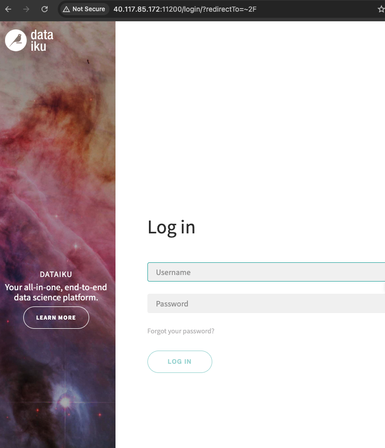

- Login using admin:admin credentials.
- Create sample workspace `khun`

**Check point**: Create a sample project (Dataiku TShirts) and build the entire flow

- Click on the grid dots near next to the search bar and browse projects
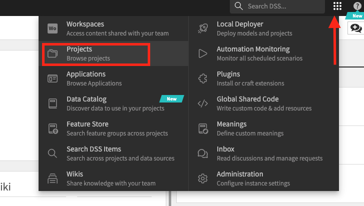
- Click NEW PROJECT and select Sample projects
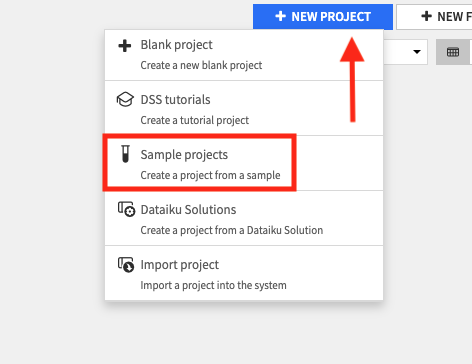
- Select Dataiku TShirts project
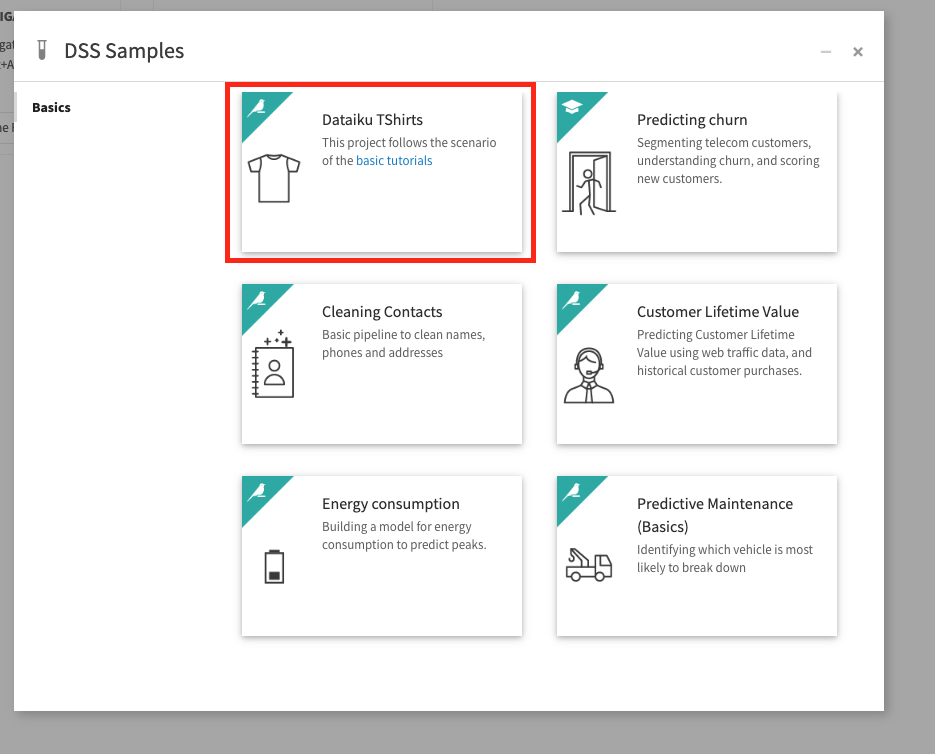
- Encountered some permission issue the user profile to "Data Scientist" profile needed. To solve that, click to the grid dots near search box and go Adminstration. Then click on security and select admin user. Select `Platform admin` in the dropdown box for Profile and save.
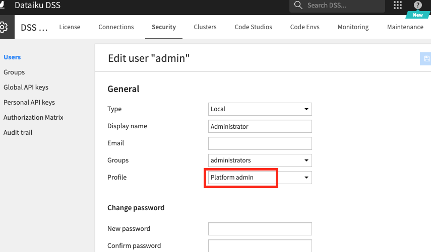
- To build the entire flow, select Build all in FLOW ACTIONS and select Force-rebuild all dependencies and click BUILD
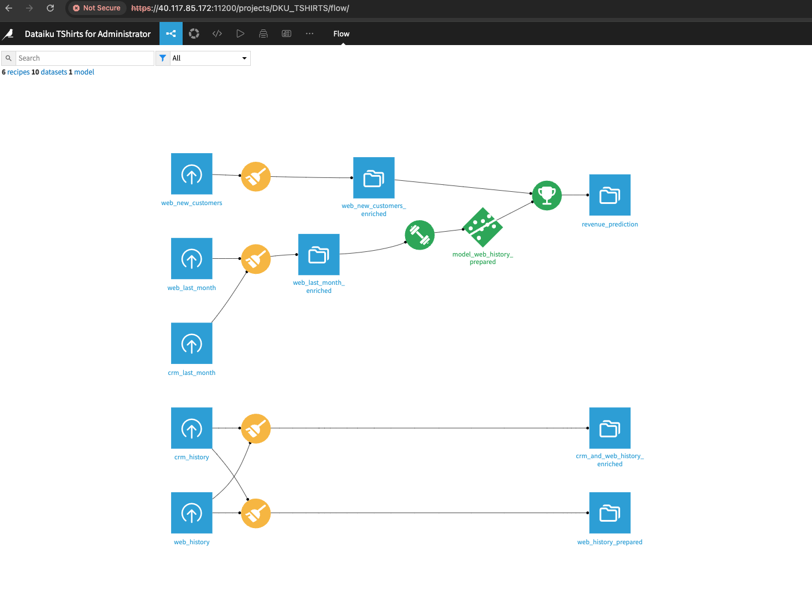
- Go to the Jobs (play button) and run the build
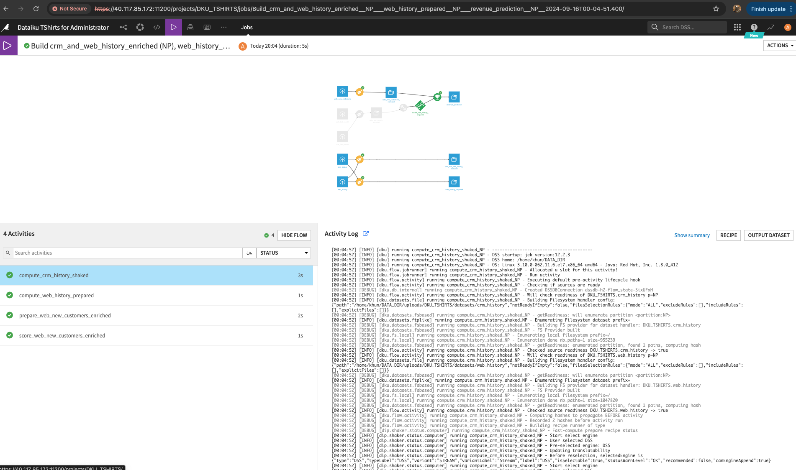

For more info on Flow, visit [Concept-Flow](https://knowledge.dataiku.com/latest/getting-started/dataiku-ui/concept-flow.html)

### Installation of R and R-integration

- Navigate to the DATA_DIR `cd /home/khun/DATA_DIR`
- Stop the DSS `./bin/dss stop`
- Run R installation script `./bin/dssadmin install-R-integration` and failed due to dependency check.
- Install required dependencies `sudo -i "/home/khun/INSTALL_DIR/dataiku-dss-12.2.3/scripts/install/install-deps.sh" -without-java -without-python -with-r`
- Once dependencies installed, start the DSS back up `./bin/dss start`

## Exercise 2 - Define a DSS connection to Azure Blob Storage Connection

**Check point**: In the TShirts project, change the connection of the managed datasets to the new Azure Blob Storage connection
- First, setup a new connection. Go to grid dots, select Adminstration, go to Connections, and click on +NEW CONNECTION and select Azure Blob Storage.
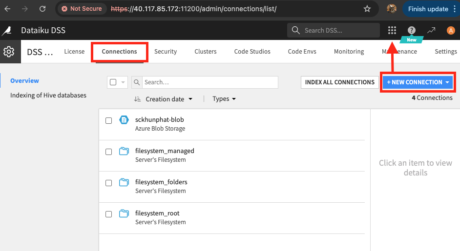
- Fill out connection details with the information provided in the excercise. Click TEST and Save!
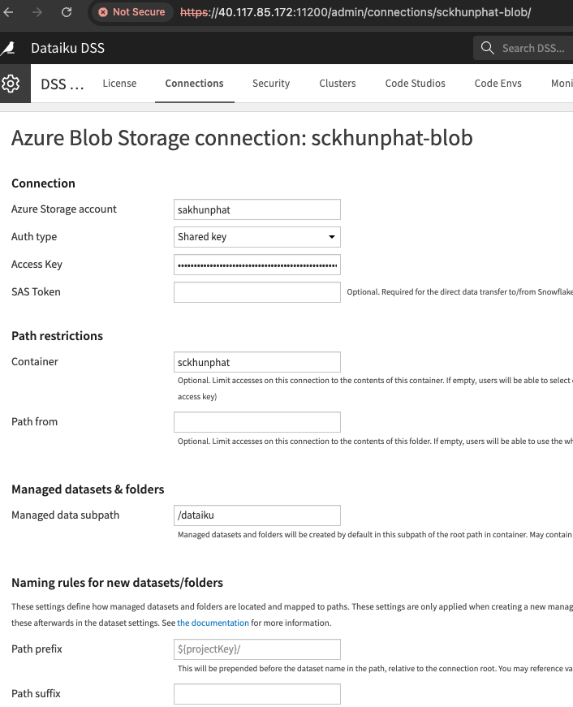
- To change all the dataset connections for the TShirts project, double click on each yellow broom icon and go to Input/Output tab and change Output to use the blob storage setup, give it a unique name and click CREATE DATASET and click SAVE.
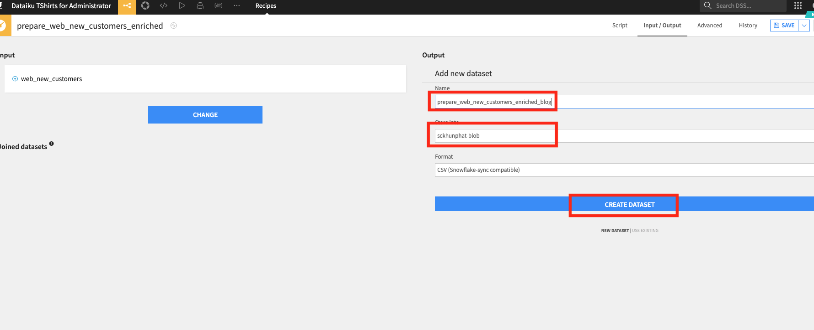
- Now we have all datasets changed to use Azure Blob Storage connection.
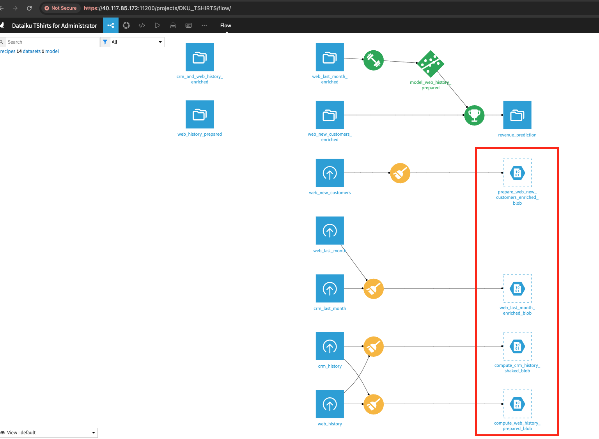

For more info on dataset connection changes, visit [Connection Changes](https://knowledge.dataiku.com/latest/data-sourcing/connections/concept-connection-changes.html)


## Exercise 3 - Connect DSS instance to AKS cluster using AKS plugin

Initial setup will include installing tools such as  `az`, `docker`, and `kubectl` and AKS plugin from the Plugins store in Dataiku DSS.

- To install the AKS plugin, head to the Dataiku dashboard, click on the grid dots, select Plugins, search for the AKS plugin, click install.
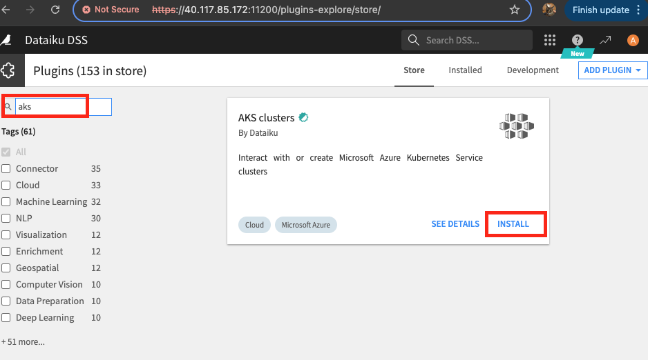

- Build code environment
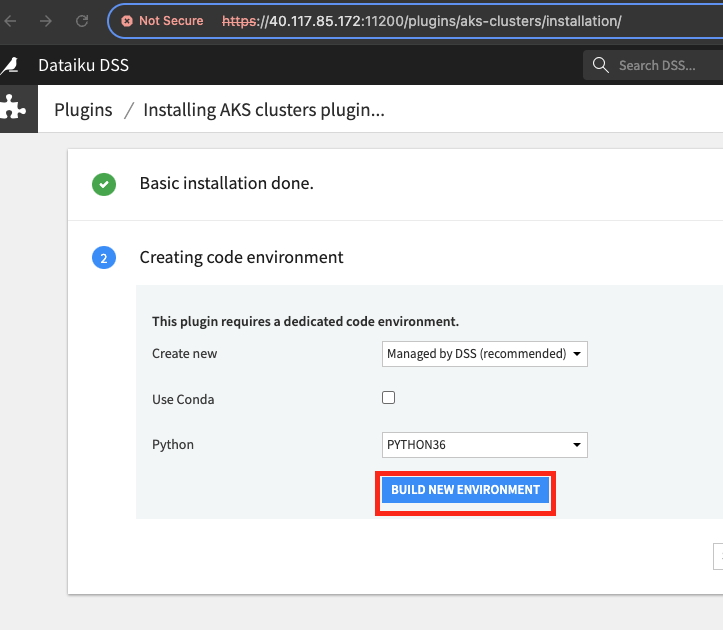

- Plugins installed
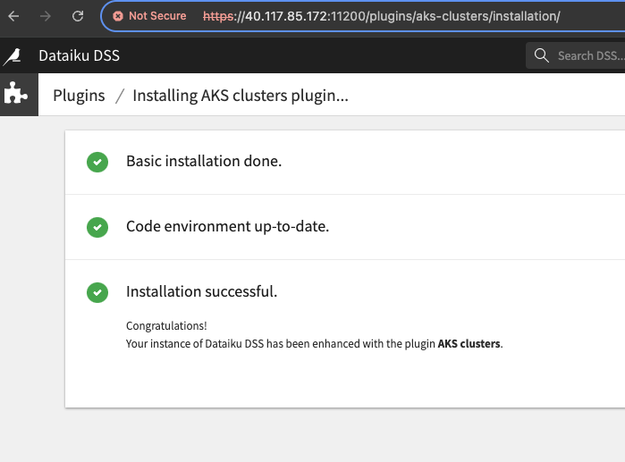

- Install azure-cli
```
sudo rpm --import https://packages.microsoft.com/keys/microsoft.asc 

sudo sh -c 'echo -e "[azure-cli]
name=Azure CLI
baseurl=https://packages.microsoft.com/yumrepos/azure-cli
enabled=1
gpgcheck=1
gpgkey=https://packages.microsoft.com/keys/microsoft.asc" > /etc/yum.repos.d/azure-cli.repo'

sudo yum install azure-cli 
```

- Install docker
```
curl -fsSL https://get.docker.com/ | sh
sudo systemctl start docker
sudo systemctl enable docker
```

- Install kubectl
```
curl -LO "https://dl.k8s.io/release/$(curl -L -s https://dl.k8s.io/release/stable.txt)/bin/linux/amd64/kubectl"

curl -LO "https://dl.k8s.io/release/$(curl -L -s https://dl.k8s.io/release/stable.txt)/bin/linux/amd64/kubectl.sha256"

echo "$(cat kubectl.sha256)  kubectl" | sha256sum --check
sudo install -o root -g root -m 0755 kubectl /usr/local/bin/kubectl
kubectl version --client
```

- Login to Azure using credentials provided 
```
az login --service-principal --username client_d --password client_secret --tenant tenant_id
Output:
[
  {
    "cloudName": "AzureCloud",
    "homeTenantId": "3ceb0d29-d7de-4204-b431-3f9f8edb2106",
    "id": "82852abb-55ae-44d8-9bac-4632a4173215",
    "isDefault": true,
    "managedByTenants": [
      {
        "tenantId": "2f4a9838-26b7-47ee-be60-ccc1fdec5953"
      }
    ],
    "name": "Dataiku FE",
    "state": "Enabled",
    "tenantId": "3ceb0d29-d7de-4204-b431-3f9f8edb2106",
    "user": {
      "name": "477faa0c-6780-448f-bdcc-5eb5d4bd38a5",
      "type": "servicePrincipal"
    }
  }
]
```

- Login to Azure Container Registry using details provided `az acr login --name khunphatacr.azurecr.io`

Ran into docker permission issue:
```
2024-09-16 03:20:19.111421 An error occurred: DOCKER_COMMAND_ERROR
permission denied while trying to connect to the Docker daemon socket at unix:///var/run/docker.sock: Get "http://%2Fvar%2Frun%2Fdocker.sock/v1.45/containers/json": dial unix /var/run/docker.sock: connect: permission denied
```
To resolve it, add khun user to the docker group `sudo usermod -aG docker khun` and change file permission `sudo chmod 666 /var/run/docker.sock ` then you get to see this:
```
az acr login --name khunphatacr.azurecr.io
The login server endpoint suffix '.azurecr.io' is automatically omitted.
Login Succeeded
```
- Build the base image in `DATA_DIR` directory following steps from [k8s-base-image](https://doc.dataiku.com/dss/latest/containers/setup-k8s.html#k8s-base-image)

```
./bin/dssadmin build-base-image --type container-exec

```
Ran into building base image issues:
```
#8 1.594 Could not retrieve mirrorlist http://mirrorlist.centos.org/?release=7&arch=x86_64&repo=os&infra=container error was
#8 1.594 14: curl#6 - "Could not resolve host: mirrorlist.centos.org; Unknown error"

#8 1.597 Cannot find a valid baseurl for repo: base/7/x86_64

ERROR: failed to solve: process "/bin/sh -c yum -y update     && yum -y install epel-release     && . /etc/os-release && case \"$VERSION_ID\" in         7*) yum -y install procps python3-devel python-devel;;         8*) yum -y install procps-ng python36-devel glibc-langpack-en python2-devel;;         *) echo 2>&1 'OS version not supported'; exit 1;;        esac     && yum -y install curl util-linux bzip2 nginx expat zip unzip freetype libgfortran libgomp libicu-devel libcurl-devel openssl-devel libxml2-devel       && yum -y groupinstall \"Development tools\"     && yum -y autoremove     && yum clean all" did not complete successfully: exit code: 1
Traceback (most recent call last):
  File "/home/khun/INSTALL_DIR/dataiku-dss-12.2.3/resources/container-exec/build-images.py", line 1112, in <module>
    run_wait_check(docker_cmd)
  File "/home/khun/INSTALL_DIR/dataiku-dss-12.2.3/resources/container-exec/build-images.py", line 927, in run_wait_check
    raise Exception("Command failed: %s - code %s" % (cmd, retcode))
Exception: Command failed: ['docker', 'build', '-t', 'dku-exec-base-emdmyufhkc9yirrx5rekxdzk:dss-12.2.3', '/home/khun/DATA_DIR/tmp/exec-docker-base-image.dkjyfrvj'] - code 1
```

Based on the logs and some research, it seems to be [CentOS 7 end of life](https://support.hcltechsw.com/community?id=community_blog&sys_id=98f8b04387c742145440c9d8cebb3500) issues. To resolve it, I checked the options for `dssadmin` to see if I can pass in any other linux distributions, then I see this:

```
  --distrib {centos7,almalinux8}
                        [mode=build only] Base distribution to use when
                        building from scratch
```
I passed in `--distrib` to use almalinux8 distribution `./bin/dssadmin build-base-image --type container-exec --distrib almalinux8` still failed:

```
ERROR: failed to solve: process "/bin/sh -c build/install-packages-builtin.sh R ${DKU_R_LIB_SUBPATH} build/minimal-packages-base.txt https://cloud.r-project.org" did not complete successfully: exit code: 1
Traceback (most recent call last):
  File "/home/khun/INSTALL_DIR/dataiku-dss-12.2.3/resources/container-exec/build-images.py", line 1112, in <module>
    run_wait_check(docker_cmd)
  File "/home/khun/INSTALL_DIR/dataiku-dss-12.2.3/resources/container-exec/build-images.py", line 927, in run_wait_check
    raise Exception("Command failed: %s - code %s" % (cmd, retcode))
Exception: Command failed: ['docker', 'build', '-t', 'dku-exec-base-emdmyufhkc9yirrx5rekxdzk:dss-12.2.3', '/home/khun/DATA_DIR/tmp/exec-docker-base-image.czi971h_'] - code 1
```
Another route to get the base image, is to download tar file from the repository same where the Dataiku installer is `wget https://downloads.dataiku.com/public/studio/12.2.3/container-images/dataiku-dss-ALL-base_dss-12.2.3-almalinux8-r4-py3.9.tar.gz` and load the docker image `docker load -i dataiku-dss-ALL-base_dss-12.2.3-almalinux8-r4-py3.9.tar.gz`

Ran into the disk running out of space:
```
df03097acf65: Loading layer [==================================================>]  275.5MB/275.5MB
8ae2d4ba041e: Loading layer [==================================================>]  4.096kB/4.096kB
9bec5a59d6a1: Loading layer [=====================================>             ]  934.7MB/1.254GB
open /usr/share/texlive/texmf-dist/fonts/afm/public/cm-super/sfbso10.afm.gz: no space left on device
```
To resolove the spacing issue, mount the extra disk `sudo mkfs.xfs /dev/sdc && sudo mount /dev/sdc /mnt/data` and move the docker data to use the new mounted disk:
```
sudo mkidr -p /mnt/data/docker  #make docker dir in new disk
sudo rsync -aP /var/lib/docker/ /mnt/data/docker/   #move docker data to new location
sudo mv /var/lib/docker /var/lib/docker.bak   #back old docker dir
sudo ln -s /mnt/data/docker /var/lib/docker   #create symbolic link to new location
sudo systemctl start docker
```
- Rerun the docker load command `docker load -i dataiku-dss-ALL-base_dss-12.2.3-almalinux8-r4-py3.9.tar.gz` then you should see the docker images:

```
docker images

REPOSITORY                        TAG                              IMAGE ID       CREATED         SIZE
dataiku-dss-apideployer-base      dss-12.2.3-almalinux8-r4-py3.9   2cfff5691ca6   11 months ago   5.02GB
dataiku-dss-spark-exec-base       dss-12.2.3-almalinux8-r4-py3.9   4dbfa6682fdd   11 months ago   5.06GB
dataiku-dss-container-exec-base   dss-12.2.3-almalinux8-r4-py3.9   0b1a67df0fce   11 months ago   4.25GB
```

- Create a new containerized execution config on the dashboard
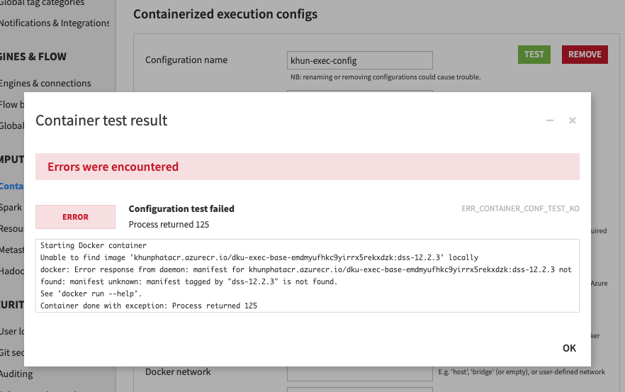

Ran into image naming issues since I did not build it sucessfully and went with downloading the base image from source. I believe to resolve this issue, I have retag the image. `docker tag dataiku-dss-container-exec-base:dss-12.2.3-almalinux8-r4-py3.9 dku-exec-base-emdmyufhkc9yirrx5rekxdzk:dss-12.2.3` After the image retagged, I was able to test out the container on dashboard and push the image:

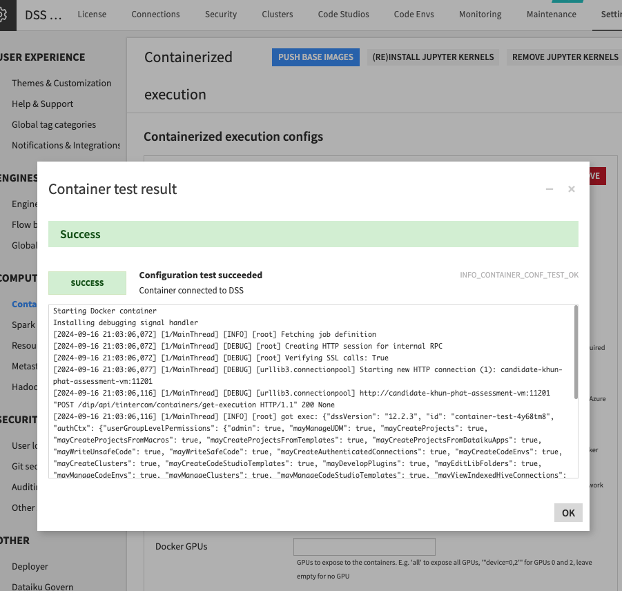

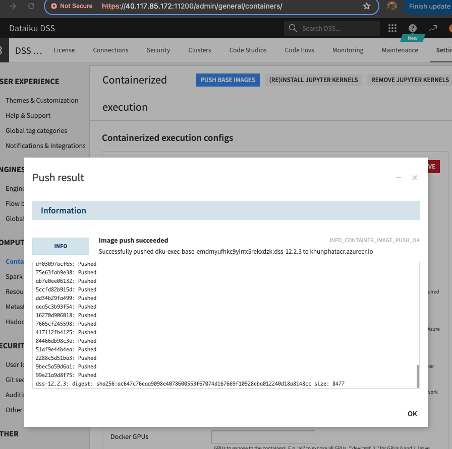

- Setup AKS connection in the plugin setting
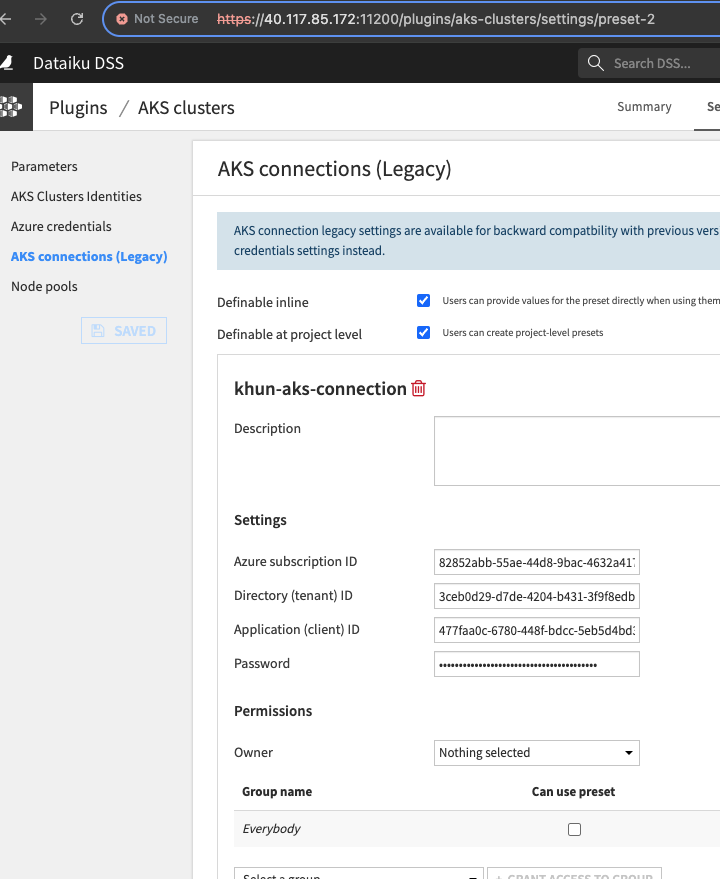

- Setup AKS Cluster Identity 
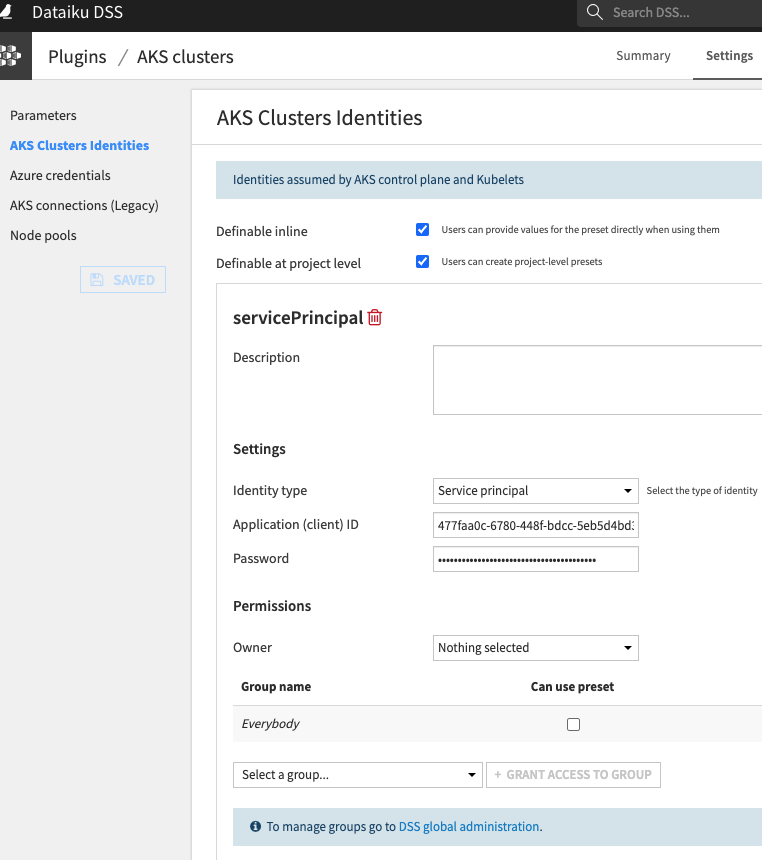

- Setup AKS Node Pools 
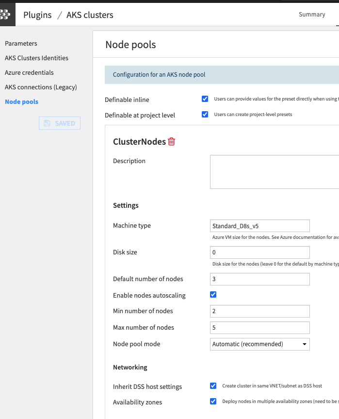

- Now that we have setup the AKS connections and settings in the plugin, We're going to create the AKS cluster following this [managed-k8s](https://doc.dataiku.com/dss/latest/containers/managed-k8s-clusters.html)  - Go to Adminstration > Clusters > CREATE AKS CLUSTER. Fill in the network details and click START.

Ran into Python SKD is being too old:
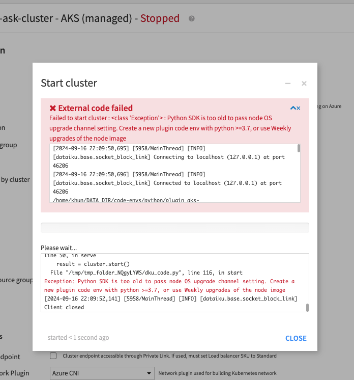

Tried to rebuild the code env to have new python sdk, but ran into another issue: 

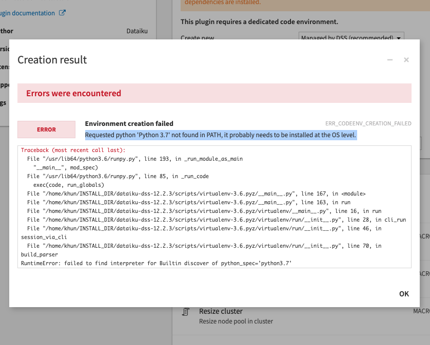

To resolve the python3.7 issue:

```
cd /usr/src
sudo wget https://www.python.org/ftp/python/3.7.12/Python-3.7.12.tgz
sudo tar xzf Python-3.7.12.tgz
cd Python-3.7.12
sudo ./configure --enable-optimizations
sudo make altinstall

python3.7 --version

Python 3.7.12
```
Reran the code environment build and it succeeded with warnings:

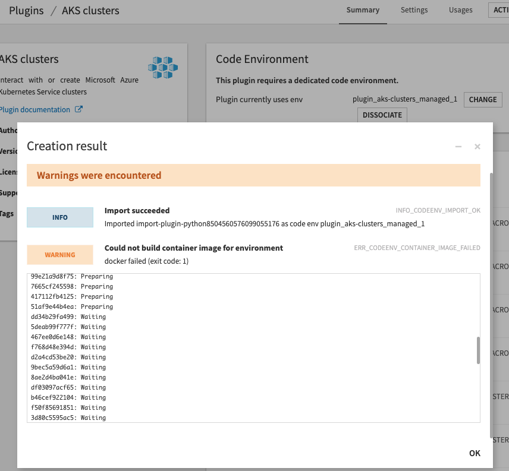

Failed to start AKS cluster again due to missing the `_ctypes` module. Had to reinstall python3.7 and here the steps following this link https://community.dataiku.com/discussion/24906/python-3-7-code-env-creation-issue:

```
sudo yum groupinstall "Development Tools"
sudo yum install openssl-devel zlib-devel bzip2-devel openssl-devel ncurses-devel sqlite-devel readline-devel tk-devel gdbm-devel xz-devel

sudo ./configure --enable-optimization
sudo make altinstall
```
- After reinstalling pything and all the dependencies, had to re-install the AKS plugin, and re-create the cluster with below details and start the AKS cluster:
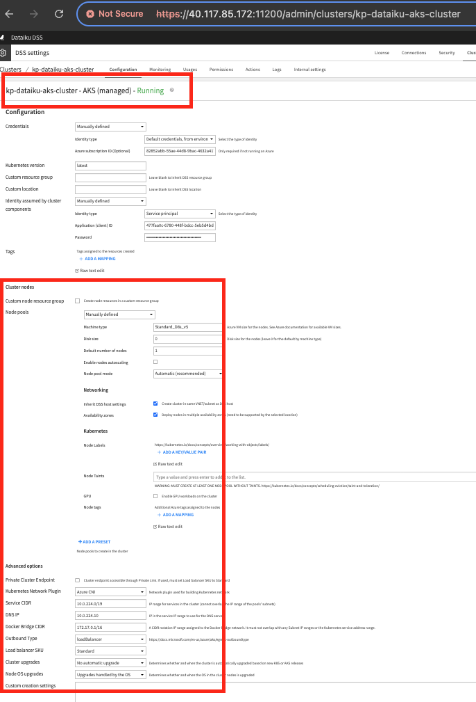

For figuring out the subnet range and picking the right DNS IP, I used this [visual subnet calculator](https://www.davidc.net/sites/default/subnets/subnets.html)

**Check point**: In the TShirts project, create a simple Python recipe and run it in a container

- After the AKS cluster was able to start, we now can create a simple Python recipe. Go to Adminstration > Code Envs > NEW PYTHON ENV and configure Code Env and make sure Containerized execution setting is correct:

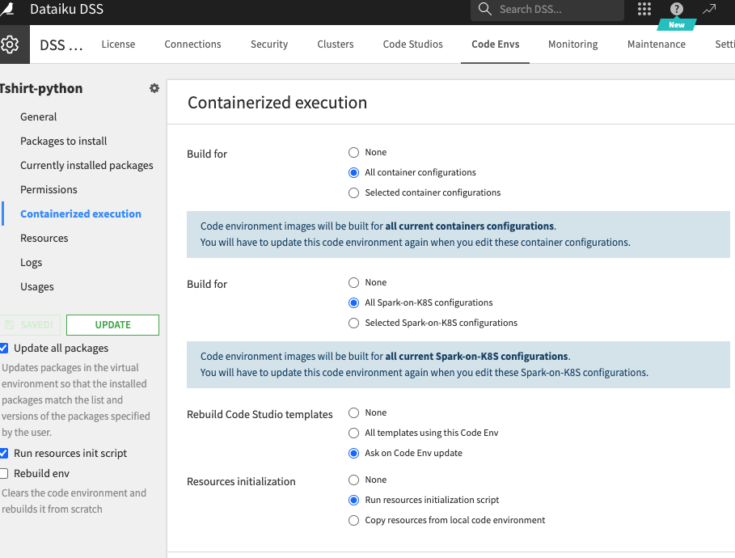

- Pick a flow in the Tshirts project, and add new Python recipe and configure the output:

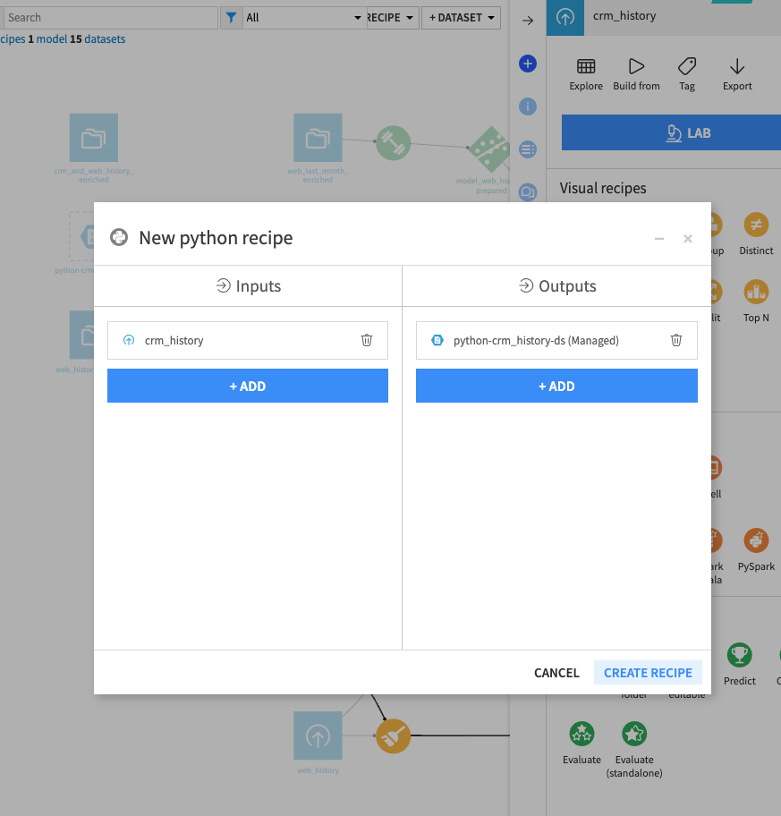

- Go to Recipes, and configure Advanced setting in the Container Configuration to use the previously Containerized Exec config:

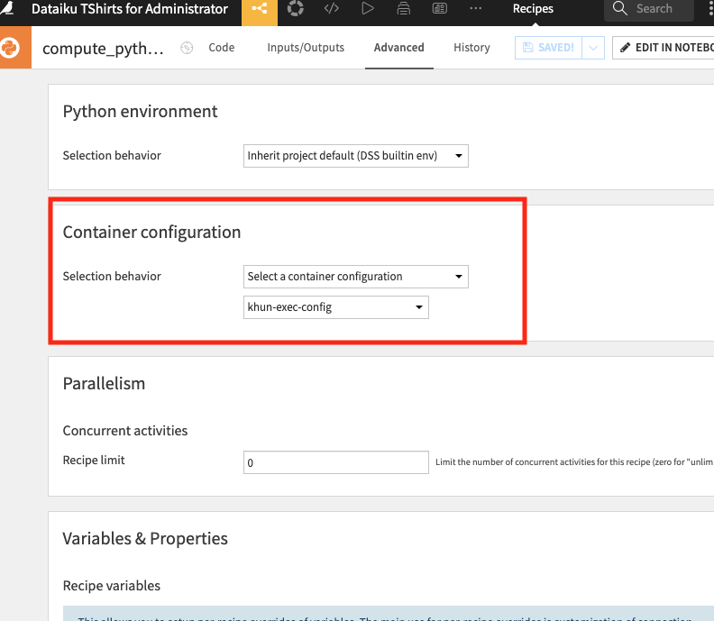

- In the recipe setting page, go to Code, and click RUN

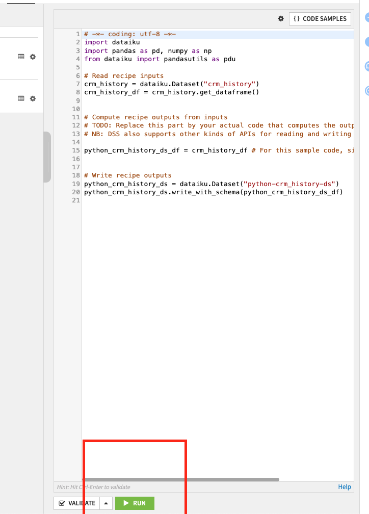

- Head to Adminstration > Clusters > select cluster > Monitoring, then we can see the Python recipe job running as a pod in the cluster:"

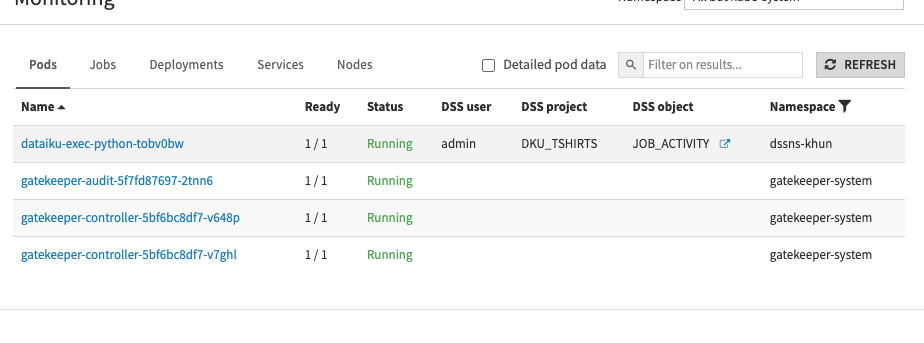

For more info, visit [Managed AKS](https://doc.dataiku.com/dss/latest/containers/aks/managed.htm)

## Exercise 4 - Expose DSS on HTTPS

To enable HTTPS connections to the DSS instance, here are steps taken:

- In Generate a SSL server certificate and private key file using openssl `openssl req -newkey rsa:4096  -x509  -sha512  -days 365 -nodes -out certificate.pem -keyout privatekey.pem`
- Edit the `install.ini` file to have SSL configs with the paths to the cert.pem and privatekey.key
```
[server]
port = 11200
ssl = true
ssl_certificate = /home/khun/INSTALL_DIR/certificate.pem
ssl_certificate_key = /home/khun/INSTALL_DIR/privatekey.key
ssl_ciphers = recommended
```
- In the DATA_DIR directory, stop the DSS instance `./bin/dss stop`
- Re-generate DSS config with the new SSL settings `./bin/dssadmin regenerate-config`
- Restart the DSS instance `./bin/dss start`

With the self-signed certificate, web browsers do not recognize it as a valid ssl cert and will give a warning to visitors that the web site cert cannot be verified. Hence the connection is not secured.


Another way to configure HTTPS connection to the DSS instance is to use nginx as a reverse proxy server:

- Make sure nginx and epel-release installed `sudo yum install nginx && sudo yum install epel-release`
- Start nginx `sudo systemctl start nginx` and check the status of it `sudo systemctl status nginx.service`. You should see something like: 

```
● nginx.service - The nginx HTTP and reverse proxy server
   Loaded: loaded (/usr/lib/systemd/system/nginx.service; disabled; vendor preset: disabled)
   Active: active (running) since Sun 2024-09-15 19:17:41 UTC; 41s ago
  Process: 1710 ExecStart=/usr/sbin/nginx (code=exited, status=0/SUCCESS)
  Process: 1707 ExecStartPre=/usr/sbin/nginx -t (code=exited, status=0/SUCCESS)
  Process: 1705 ExecStartPre=/usr/bin/rm -f /run/nginx.pid (code=exited, status=0/SUCCESS)
 Main PID: 1712 (nginx)
   CGroup: /system.slice/nginx.service
           ├─1712 nginx: master process /usr/sbin/nginx
           ├─1713 nginx: worker process
           ├─1714 nginx: worker process
           ├─1715 nginx: worker process
           └─1716 nginx: worker process

Sep 15 19:17:41 candidate-khun-phat-assessment-vm systemd[1]: Starting The nginx HTTP and reverse proxy server...
Sep 15 19:17:41 candidate-khun-phat-assessment-vm nginx[1707]: nginx: the configuration file /etc/nginx/nginx.conf syntax is ok
Sep 15 19:17:41 candidate-khun-phat-assessment-vm nginx[1707]: nginx: configuration file /etc/nginx/nginx.conf test is successful
Sep 15 19:17:41 candidate-khun-phat-assessment-vm systemd[1]: Started The nginx HTTP and reverse proxy server.
```

- Set it to start on boot `sudo systemctl enable nginx`

- Add ssl settings to the /etc/nginx/nginx.conf file:
```
server {
    # Host/port on which to expose Data Science Studio to users
    listen 443 ssl;
    server_name 40.117.85.172;
    ssl_certificate /etc/nginx/ssl/certificate.pem;
    ssl_certificate_key /etc/nginx/ssl/privatekey.key;
    location / {
        # Base url of the Data Science Studio installation
        proxy_pass http://40.117.85.172:11200/;
        proxy_redirect http://40.117.85.172 https://40.117.85.172;
        proxy_redirect http://40.117.85.172 https://40.117.85.172;
        # Allow long queries
        proxy_read_timeout 3600;
        proxy_send_timeout 600;
        # Allow large uploads
        client_max_body_size 0;
        # Allow large downloads
        proxy_max_temp_file_size 0;
        # Allow protocol upgrade to websocket
        proxy_http_version 1.1;
        proxy_set_header Host $http_host;
        proxy_set_header Upgrade $http_upgrade;
        proxy_set_header Connection "upgrade";
        proxy_set_header X-Forwarded-For $proxy_add_x_forwarded_for;
    }
}
```

- Restart nginx service `sudo systemctl restart nginx`

For more info on configruing host to accept HTTPS, visit [HTTPS config](https://doc.dataiku.com/dss/latest/installation/custom/advanced-customization.html) and [Reverse Proxy](https://doc.dataiku.com/dss/latest/installation/custom/reverse-proxy.html)

## Exercise 5 - Running Managed Spark on AKS cluster and Integrate with Azure Blog Storage

download tar of spark
install it using  dssadmin
start dss back 
setup spark config and got basic spark configs from online
push image, but got error
docker tag image 
docker push spark image via ui 
go to the tshirt flow 
click on all yellow brooms (datasets) and change to spark engine
after build all flow (force rebuild dep)
faced issues with running spark jobs
solved by changing the name of the config to default
re run spark jobs and show that pods are runnings in the cluster (screenshots)

## Exercise 6 - User Isolation (UIF) Activation on DSS 

following this link https://doc.dataiku.com/dss/latest/user-isolation/initial-setup.html
stop dss
login back in as admin and sudo su - (root)
then ./bin/dssadmin install-impersonation khun (show screenshots)
As root, edit the /etc/dataiku-security/INSTALL_ID/security-config.ini file. In the [users] section, fill in the allowed_user_groups settings with the list of UNIX groups that your end users belong to. Only users belonging to these groups will be allowed to use the local code impersonation mechanism.

configure identity mapping 

after configuring identitiy mapping, rebuilding the job and failed (show screenshots)
trying to resolove file  system permission issue  
as root, modify the khun user setting to have no password `khun ALL=(ALL) NOPASSWD:ALL`
rebuilding the job 


