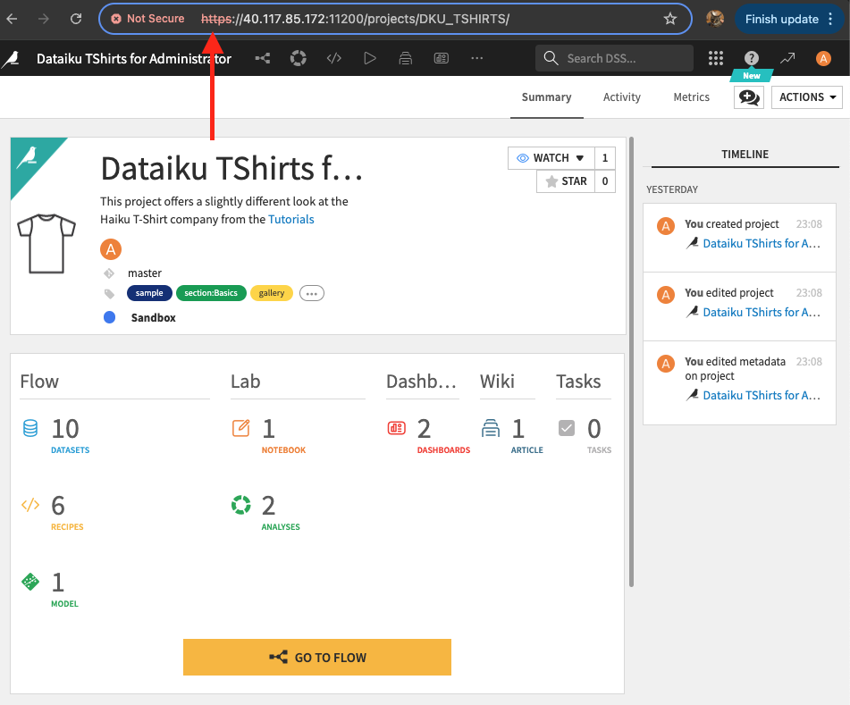

# Dataiku Installation and Integrations with Azure Services
This repo stores information on how to install Dataiku DSS on an Azure instance, integrate it with other Azure services such as Blob Storage and AKS cluster.

## Excercise 1 - Install a DSS instance (Design Node) - Install with port 11200
Given the SSH details to the Azure instance, here are the steps taken to complete excercise 1.

- SSH into the Azure VM using the Admin username and password `ssh assessment_admin@40.117.85.172`
- After logged in, make sure to login as yourself instead of the admin account (If you don't see yourself as a user by checking `less /etc/passwd`, create a user and choose the password `sudo adduser -m khun && sudo passwd khun`). `-m` creates the home directory for myself.
- Switch user to yourself when performing the installation `su khun`. Verify yourself to make sure you're logged in properly `id` and output should look like this `uid=1001(khun) gid=1001(khun) groups=1001(khun) context=unconfined_u:unconfined_r:unconfined_t:s0-s0:c0.c1023`
- Create 2 directories for the DSS installation. `INSTALL_DIR` for the downloaded DSS tar.gz and `DATA_DIR` for the configs of Dataiku DSS (datasets, recipes, insights, models, log files, etc.) `mkdir INSTALL_DIR DATA_DIR`
- Change directory to the INSTALL_DIR `cd INSTALL_DIR`
- Create a License file for the installation `vi dataiku-license.json` copy and paste the provided temporary license JSON file into this file and save, esc and `:x!`.
- Download the DSS installer kit `wget https://downloads.dataiku.com/public/studio/12.2.3/dataiku-dss-12.2.3.tar.gz`
- Unzip the DSS tarball `tar xzf dataiku-dss-12.2.3.tar.gz`
- Check to see what's in the folder `ls dataiku-dss-12.2.3`, should see all the dependency folders and `installer.sh` script
- Install Dataiku DSS `dataiku-dss-12.2.3/installer.sh -d /home/khun/DATA_DIR/ -p 11200 -l dataiku-license.json`

First run, ran into an error: 
```
*********************************************
*           Dataiku DSS installer           *
*********************************************
[+] Using data directory: /home/khun/DATA_DIR
[+] Saving installation log to /home/khun/DATA_DIR/run/install.log
[!] *********************************************************
[!] Warning: you have SELinux installed and enforcing.
[!] DSS cannot run unless you edit the policies to allow nginx to serve its files.
[!] Press Enter to continue, Ctrl+C to abort

[*] Could not find suitable version of Java
[+] Checking required dependencies
+ Detected OS distribution : centos 7
+ Checking required packages...
*** Error: package git not found
*** Error: package nginx not found
*** Error: package java-1.8.0-openjdk not found
*** Error: package python3 not found
*** Error: package libgfortran not found

[-] Dependency check failed
[-] You can install required dependencies with:
[-]    sudo -i "/home/khun/INSTALL_DIR/dataiku-dss-12.2.3/scripts/install/install-deps.sh"
[-] You can also disable this check with the -n installer flag
```
- To solve this dependency issue, run the `install-deps.sh` script `sudo -i "/home/khun/INSTALL_DIR/dataiku-dss-12.2.3/scripts/install/install-deps.sh"`

*Maybe optional* - Then ran into Sudoers issue with khun user, to resolve it, logout of khun user back to admin account and add khun to the `1000(assessment_admin)` group `sudo usermod -a -G 1000 khun`

- Also need to add khun user to the `etc/sudoers` file by doing `sudo EDITOR=vi visudo` and add `username  ALL=(ALL) ALL ` to end of file and save.

- Login back in as khun user `su khun` and run `sudo -i "/home/khun/INSTALL_DIR/dataiku-dss-12.2.3/scripts/install/install-deps.sh"`

- After resolving the dependencies issue, rerun the installation script `dataiku-dss-12.2.3/installer.sh -d /home/khun/DATA_DIR/ -p 11200 -l dataiku-license.json`. You should see the output: 

```
- Validating: OK

    To initialize this nbextension in the browser every time the notebook (or other app) loads:
    
          jupyter nbextension enable widgetsnbextension --user --py
    
Extension collapsible_headings/main enabled successfully
Extension codefolding/main enabled successfully
Extension toggle_all_line_numbers/main enabled successfully
Extension hide_input_all/main enabled successfully
Extension addbefore/main enabled successfully
Extension jupyter-js-widgets/extension enabled successfully
[+] Generating default env file
[+] Generating supervisor configuration
[+] Generating nginx configuration
***************************************************************
* Installation complete (DSS node type: design)
* Next, start DSS using:
*         '/home/khun/DATA_DIR/bin/dss start'
* Dataiku DSS will be accessible on http://<SERVER ADDRESS>:11200
*
* You can configure Dataiku DSS to start automatically at server boot with:
*    sudo -i "/home/khun/INSTALL_DIR/dataiku-dss-12.2.3/scripts/install/install-boot.sh" "/home/khun/DATA_DIR" khun
***************************************************************
```

- Start the DSS `/home/khun/DATA_DIR/bin/dss start`. You should see below status:

```
Waiting for DSS supervisor to start ...
backend                          STARTING  
ipython                          STARTING  
nginx                            STARTING  
DSS started, pid=22436
Waiting for DSS backend to start ......
```

- We can now head to the UI: http://40.117.85.172:11200/. You should see something like this:


- Login using admin:admin credentials.
- Create sample workspace `khun`

**Check point**: Create a sample project (Dataiku TShirts) and build the entire flow

- Click on the grid dots near next to the search bar and browse projects

- Click NEW PROJECT and select Sample projects

- Select Dataiku TShirts project

- Due to permission issues related to "Data Scientist" profile needed, here is previewing and pre-building the entire flow


For more info on Flow, visit [Concept-Flow](https://knowledge.dataiku.com/latest/getting-started/dataiku-ui/concept-flow.html)

### Installation of R and R-integration

- Navigate to the DATA_DIR `cd /home/khun/DATA_DIR`
- Stop the DSS `./bin/dss stop`
- Run R installation script `./bin/dssadmin install-R-integration` and failed due to dependency check.
- Install required dependencies `sudo -i "/home/khun/INSTALL_DIR/dataiku-dss-12.2.3/scripts/install/install-deps.sh" -without-java -without-python -with-r`
- Once dependencies installed, start the DSS back up `./bin/dss start`

## Exercise 2 - Define a DSS connection to Azure Blob Storage Connection

**Check point**: In the TShirts project, change the connection of the managed datasets to the new Azure Blob Storage connection

- 

For more info on dataset connection changes, visit [Connection Changes](https://knowledge.dataiku.com/latest/data-sourcing/connections/concept-connection-changes.html)


## Exercise 3 - Connect DSS instance to AKS cluster using AKS plugin


## Exercise 4 - Expose DSS on HTTPS

To enable HTTPS connections to the DSS instance, here are steps taken:

- In Generate a SSL server certificate and private key file using openssl `openssl req -newkey rsa:4096  -x509  -sha512  -days 365 -nodes -out certificate.pem -keyout privatekey.pem`
- Edit the `install.ini` file to have SSL configs with the paths to the cert.pem and privatekey.key
```
[server]
port = 11200
ssl = true
ssl_certificate = /home/khun/INSTALL_DIR/certificate.pem
ssl_certificate_key = /home/khun/INSTALL_DIR/privatekey.key
ssl_ciphers = recommended
```
- In the DATA_DIR directory, stop the DSS instance `./bin/dss stop`
- Re-generate DSS config with the new SSL settings `./bin/dssadmin regenerate-config`
- Restart the DSS instance `./bin/dss start`

With the self-signed certificate, web browsers do not recognize it as a valid ssl cert and who a warning to visitors that the web site cert cannot be verified. Hence the connection is not secured



Another way to configure HTTPS connection to the DSS instance is to use nginx as a reverse proxy server:

- Make sure nginx and epel-release installed `sudo yum install nginx && sudo yum install epel-release`
- Start nginx `sudo systemctl start nginx` and check the status of it `sudo systemctl status nginx.service`. You should see something like: 

```
● nginx.service - The nginx HTTP and reverse proxy server
   Loaded: loaded (/usr/lib/systemd/system/nginx.service; disabled; vendor preset: disabled)
   Active: active (running) since Sun 2024-09-15 19:17:41 UTC; 41s ago
  Process: 1710 ExecStart=/usr/sbin/nginx (code=exited, status=0/SUCCESS)
  Process: 1707 ExecStartPre=/usr/sbin/nginx -t (code=exited, status=0/SUCCESS)
  Process: 1705 ExecStartPre=/usr/bin/rm -f /run/nginx.pid (code=exited, status=0/SUCCESS)
 Main PID: 1712 (nginx)
   CGroup: /system.slice/nginx.service
           ├─1712 nginx: master process /usr/sbin/nginx
           ├─1713 nginx: worker process
           ├─1714 nginx: worker process
           ├─1715 nginx: worker process
           └─1716 nginx: worker process

Sep 15 19:17:41 candidate-khun-phat-assessment-vm systemd[1]: Starting The nginx HTTP and reverse proxy server...
Sep 15 19:17:41 candidate-khun-phat-assessment-vm nginx[1707]: nginx: the configuration file /etc/nginx/nginx.conf syntax is ok
Sep 15 19:17:41 candidate-khun-phat-assessment-vm nginx[1707]: nginx: configuration file /etc/nginx/nginx.conf test is successful
Sep 15 19:17:41 candidate-khun-phat-assessment-vm systemd[1]: Started The nginx HTTP and reverse proxy server.
```

- Set it to start on boot `sudo systemctl enable nginx`

- Add ssl settings to the /etc/nginx/nginx.conf file:
```
server {
    # Host/port on which to expose Data Science Studio to users
    listen 443 ssl;
    server_name 40.117.85.172;
    ssl_certificate /etc/nginx/ssl/certificate.pem;
    ssl_certificate_key /etc/nginx/ssl/privatekey.key;
    location / {
        # Base url of the Data Science Studio installation
        proxy_pass http://40.117.85.172:11200/;
        proxy_redirect http://40.117.85.172 https://40.117.85.172;
        proxy_redirect http://40.117.85.172 https://40.117.85.172;
        # Allow long queries
        proxy_read_timeout 3600;
        proxy_send_timeout 600;
        # Allow large uploads
        client_max_body_size 0;
        # Allow large downloads
        proxy_max_temp_file_size 0;
        # Allow protocol upgrade to websocket
        proxy_http_version 1.1;
        proxy_set_header Host $http_host;
        proxy_set_header Upgrade $http_upgrade;
        proxy_set_header Connection "upgrade";
        proxy_set_header X-Forwarded-For $proxy_add_x_forwarded_for;
    }
}
```

- Restart nginx service `sudo systemctl restart nginx`

For more info on configruing host to accept HTTPS, visit [HTTPS config](https://doc.dataiku.com/dss/latest/installation/custom/advanced-customization.html) and [Reverse Proxy](https://doc.dataiku.com/dss/latest/installation/custom/reverse-proxy.html)

## Exercise 5 - Running Managed Spark on AKS cluster and Integrate with Azure Blog Storage

## Exercise 6 - User Isolation (UIF) Activation on DSS 
